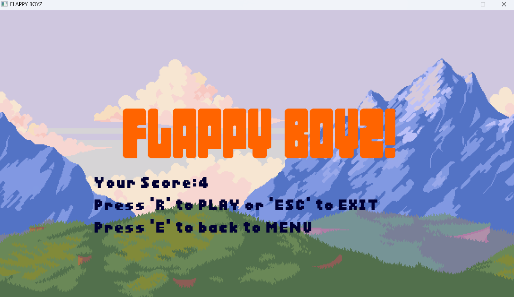
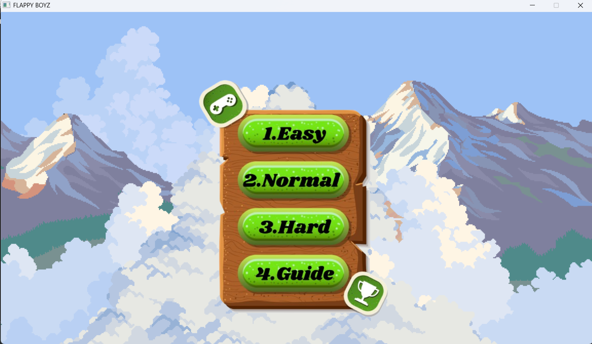
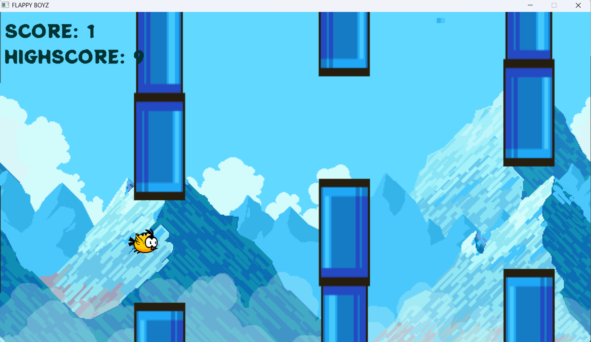

### FLAPPY_BOYZ_GAME:

Họ và tên người làm:Trần Bảo Long
MSV:24020211.
Sinh viên:Đại học CÔNG NGHỆ -UET.
Flappy_Boyz là một trò chơi được xây dựng bằng C++ và SDL2, dựa trên trò chơi huyền thoại Flappy bird mà chúng ta ai cũng biết.
  

#Project:
- GameState.h: Enum trạng thái game.
- Bird.h/cpp: Lớp quản lý chú chim.
- Object.h/cpp: Lớp quản lý cột trụ.
- Score.h/cpp: Lớp quản lí điểm số.
- High.h/cpp:Quản lí điểm cao nhất.
- Board.h/cpp:Quản lí các text,bảng của game.
- Vacham.h/cpp:Kiểm tra sự va chạm giữa Bird và Pipe.
- main.cpp: File chính chạy game

#Tính năng:
-Nhân vật chính là Bird(một chú chim màu vàng), có thể bay qua để né tránh các vật cản(các ống nước).
-Vật cản bao gồm *Các ống nước(Pipe)* và *chim (Bird)* để vượt qua chúng.
-Hiệu ứng chuyển động mượt mà với hoạt ảnh ống nước,chim cộng với backgr sinh động.
-Có 3 map chơi với 3 độ khó khác nhau tùy vào sự lựa chọn của người chơi.
-Có Bảng hướng dẫn cách chơi.
-Nhạc nền và hiệu ứng âm thanh sinh động.
-Hỗ trợ lưu High Score ngay cả khi thoát game.
-Nhấn ESC để thoát game với xác nhận trước.

#Yêu cầu:
- *C++ Compiler* (MinGW hoặc MSVC)
- *SDL2, SDL2_image, SDL2_ttf, SDL2_mixer*

#Cách Build & Chạy:
Cài đặt SDL2 và các thư viện liên quan.
1. Cài đặt SDL2, SDL_image, SDL_ttf, SDL_mixer trên máy tính.
2. Clone repository này về máy:https://github.com/24020211-TranBaoLong/Flappy_Boyz_Boww
3. Mở project trong IDE (như Visual Studio, CodeBlocks).
4. Đảm bảo các file tài nguyên (hình ảnh, âm thanh, font) nằm trong thư mục gốc của project.
5. Biên dịch và chạy file main.cpp.

#Điều Khiển
- *Phím Space hoặc các phím Enter và Keyup*: Nhảy để điều khiển qua các pipe(ống nc)
- *Phím R*: Chơi lại khi Game Over
- *Phím ESC*: Thoát game (hiện hộp thoại xác nhận)
- *Phím E*: Quay lại MENU chọn map

#Âm Thanh
Nhạc nền tự động phát khi vào game.
Hiệu ứng âm thanh khi điều khiển Bird bay.

#Lưu High Score
-Game sẽ tự động lưu điểm cao nhất vào file highscore.txt để duy trì qua các lần chơi.
-Điểm cao nhất sẽ chỉ thay đổi khi bạn vượt qua nó.

#Cấy Phép và Hỗ Trợ:
-Có tham khảo một vài ý tưởng từ các game tương tự Flappy Bird và cũng có sự tham khảo trợ giúp từ AI trong quá trình hoàn thành game(Chỉ tham khảo ý kiến và một 
vài cách thức để khiến game tốt hơn,không copy hoàn toàn từ AI).
-Dự án này được phát triển cho mục đích học tập tại UET:3 và không nhằm mục đích khác.
-Được làm trong thời gian ngắn nên có thể còn nhiều hạn chế mong người chơi thông cảm(sẽ cố gắng update)

### Ngưỡng điểm mong muốn:

Tôi cho rằng project này xứng đáng đạt mức điểm 8.5 đến 10 điểm theo barem được cung cấp.

#Lý do bảo vệ ngưỡng điểm:

Dựa trên barem điểm:

### 4-6: Học và làm game theo nội dung hướng dẫn hàng tuần của giảng viên, nộp bài đúng hạn trên GitHub:

- Tôi đã hoàn thành game Flappy Boyz theo hướng dẫn hàng tuần, bao gồm các tính năng cơ bản như điều khiển chim, vượt cột, ghi điểm,hiệu ứng background và kết thúc game.
- Project đã được nộp đúng hạn trên GitHub với đầy đủ mã nguồn và tài nguyên.

### 6.5-7:

1. *Game tự viết với thuật toán đơn giản và không đồ họa*:

   - Game có thuật toán đơn giản: điều khiển chim bằng trọng lực, di chuyển cột trụ, phát hiện va chạm,background sinh động.
   - Tuy nhiên, game của tôi có đồ họa đầy đủ, nên vượt yêu cầu này.

2. *Lấy cơ số từ code được hướng dẫn và phát triển thêm một chút*:

   - Tôi đã từ game gốc phát triển thêm các tính năng:
     +)Thêm số lượng map cho game(3 thay vì 1)
     +)Hiển thị bảng hướng dẫn,bảng select map.
     +)3 Map với 3 cấp độ game khác nhau từ dễ đến khó.
     +)Lưu điểm cao vào file.

### 7.5-8.5:

1. *Game tự viết có thuật toán nâng cao ngoài chương trình môn học*:

   - Thuật toán tăng tốc độ: Tốc độ cuộn của cột trụ tăng thêm 1 đơn vị sau mỗi cột vượt qua, làm game khó hơn theo thời gian.
   - Quản lý trạng thái game (MENU, PLAYING, GAME_OVER,INSTRUCTOR) với các sự kiện tương ứng (nhấn Esc, R,E).

2. *Game tự viết có đồ họa đơn giản*:

   - Game có đồ họa đầy đủ: hình ảnh cho chim, cột, background, mặt đất, nút Start, Game Over, Restart; hiển thị điểm số và điểm cao bằng font chữ.

3. *Game phát triển từ code mẫu nhưng có thay đổi đáng kể*:
   - Tôi đã thay đổi đáng kể so với code mẫu: Thêm các map chơi,Thêm mức độ chơi.Tăng tốc độ động,Lưu điểm cao vào file "highscore.txt".

### 9-10: Chất lượng ở top 10% của lớp

- *Điểm nổi bật*:
  - *Map và chế độ chơi*:Có 3 map chơi khác nhau với mức độ từ dễ đến khos tùy vào kĩ năng của người chơi.
  - *Hiệu ứng đồ họa và âm thanh*: Chim dao động ở MENU, màn hình rung khi va chạm, âm thanh vỗ cánh, nhạc nền.
  - *Tối ưu code*: Chia thành nhiều Header để quản lý tài nguyên hiệu quả, giảm lặp code khi hiển thị text bằng hàm "renderText".
  - *Lưu điểm cao*: Điểm cao nhất được lưu vào file "highscore.txt" và hiển thị ở màn hình GAME_OVER.
Chúc bạn chơi vui! 
